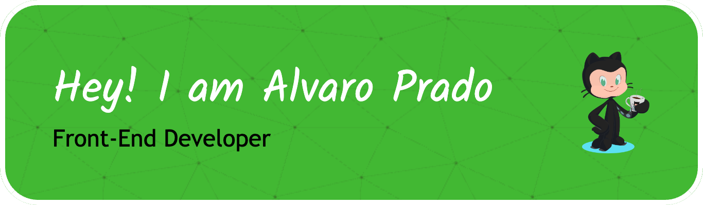

#  Bienvenid@ al GitHub de frontsitoz 👨🏻‍💻</h1>

## About me:
I'm Alvaro Prado from Perú 
🇵🇪🇵, a frontend developer in constant learning. I have almost 3 years of experience working on web applications, SPA's and even interactive games. I'm passionate about creating efficient, modular and performance-optimized user interfaces. I'm currently pursuing a degree in Systems Engineering, while balancing my studies, work and personal projects. I hope I can contribute something to you with my projects.

---

## 🚀 Technologies & Tools:
 
 
 
 
 
 
 
 
 
 
 

---
## 📊 GitHub Stats

---

## 🌐 Find me at:
- 
- 
- 
- 

---

## 🎯 Fun Facts:
- I love watching and doing sports, especially ⚽️ 🏟️.
- I don't drink much ☕️, only in extreme moments.
- I'm allergic to dust and aerosols.
- One of my passions, listening to good music 🎶🎶 all day.
- Open for interesting collaborations🤝🏼

---

